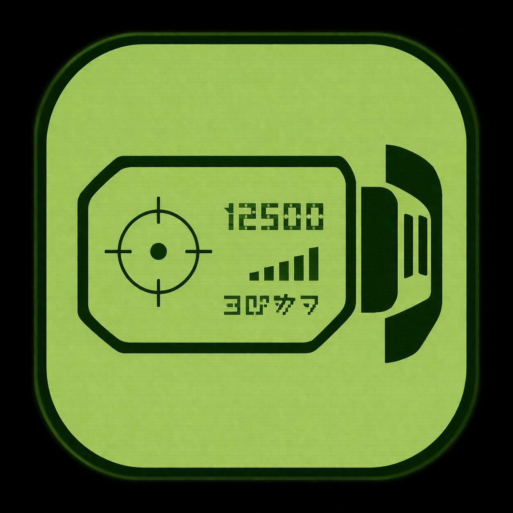
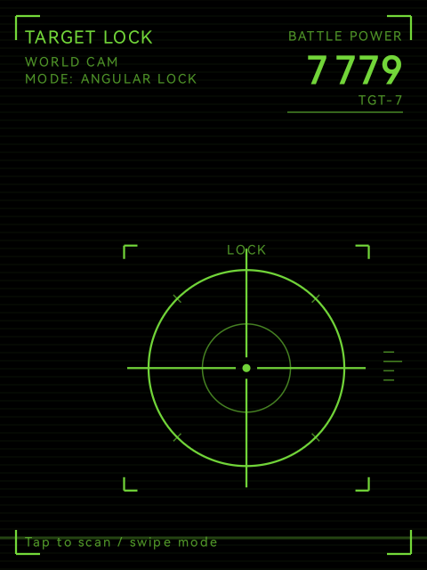
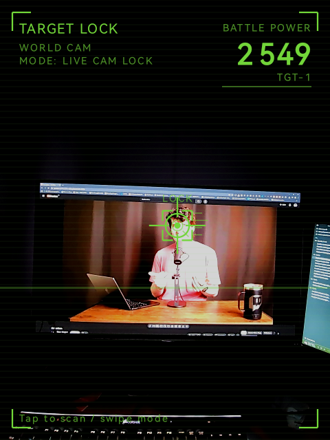

## Rokid-DragonBallScouter

<p align="center">
  
</p>

<p align="center">
  Dragon Ball-inspired scouter HUD for Rokid glasses, with live face lock, angular pseudo-AR mode, and timed battle power reveal.
</p>

<p align="center">
  <a href="https://github.com/Anezium/Rokid-DragonBallScouter/actions/workflows/build-apk.yml"></a>
</p>

---

## Screenshots

<p align="center">
  
  &nbsp;&nbsp;&nbsp;&nbsp;
  
</p>
<p align="center">
  <em>Angular HUD mode - Live camera lock mode</em>
</p>

---

## Why this repo exists

This project turns Rokid glasses into a playful Dragon Ball scouter demo instead of a plain camera HUD.

The app keeps the experience lightweight and local:

- on-device face detection with ML Kit
- a switchable `ANGULAR HUD` mode for HUD-only viewing
- a `LIVE CAM LOCK` mode for direct camera overlay
- a stable battle power per detected face
- a 6-second scan sequence with scramble animation and audio reveal

No cloud calls. No backend. Just a stylized scouter effect running directly on the glasses.

---

## Modes

- `ANGULAR HUD`: black background, pseudo-AR lock projected into the display, tuned for the "real scouter" feel
- `LIVE CAM LOCK`: direct camera preview with the lock rendered on top

During a scan:

- tap to start the scan
- swipe left or right to switch mode
- the detected face keeps the same power level while it stays tracked
- the power number scrambles during analysis, then reveals the final value at the 6th second with the detector sound
- if the face disappears or tracking is lost, the sound and reveal sequence stop immediately

---

## Features

- built for Rokid glasses form factor and monochrome green display style
- 20-second scan sessions with `PRESS TO SCAN` standby state
- switchable pseudo-AR HUD and live camera tracking modes
- same-face power memory to avoid random value jumps on stable tracking
- custom launcher icon and Dragon Ball detector audio cue
- real-device build verified and tested on Rokid glasses

---

## Build

```powershell
$env:JAVA_HOME='C:\Program Files\Android\Android Studio\jbr'
$env:Path="$env:JAVA_HOME\bin;$env:Path"
.\gradlew.bat assembleDebug
```

The debug APK is generated at `app/build/outputs/apk/debug/app-debug.apk`.

If you want a clean distributable filename, copy it as `DragonBallScouter-debug.apk` before publishing.

GitHub Actions also builds the debug APK automatically on pushes, pull requests, and manual runs.

---

## First run

1. Install the APK on the Rokid glasses.
2. Open `DragonBall Scouter`.
3. Grant the camera permission when prompted.
4. Tap to start a scan.
5. Keep a face in frame and wait for the 6-second reveal.
6. Swipe left or right if you want to switch between `ANGULAR HUD` and `LIVE CAM LOCK`.

---

## Notes

- The repo includes the original logo and sound assets used by the app.
- This is an Android MVP tuned around Rokid glasses behavior, so exact camera alignment can still vary by device and fit.
